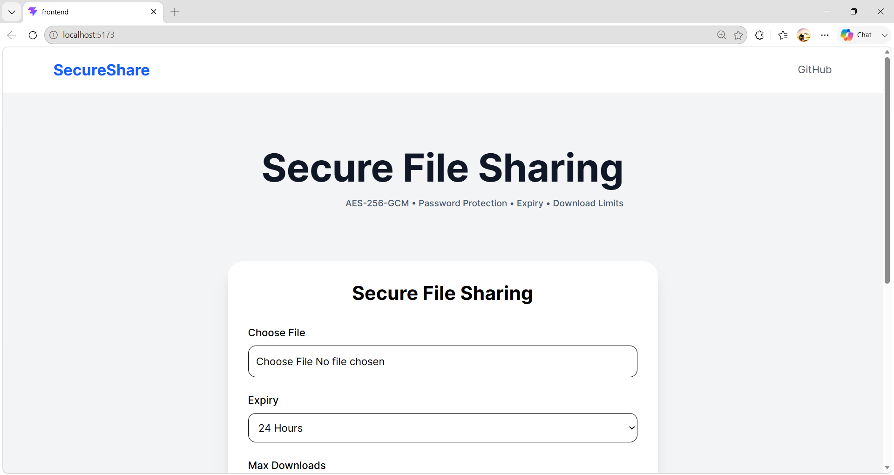
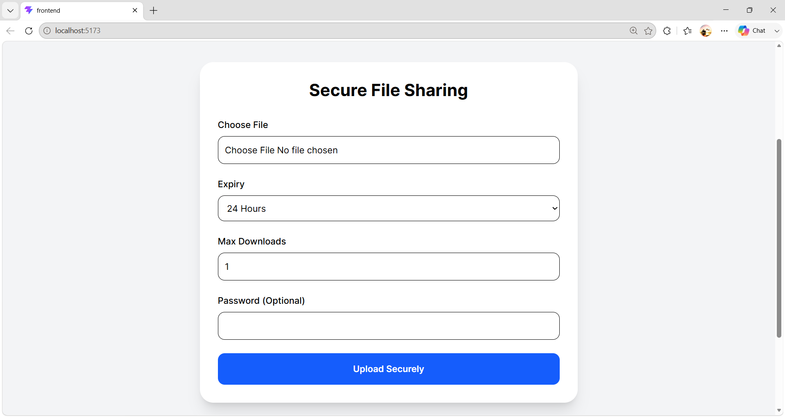
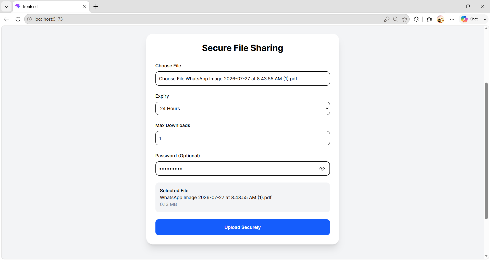
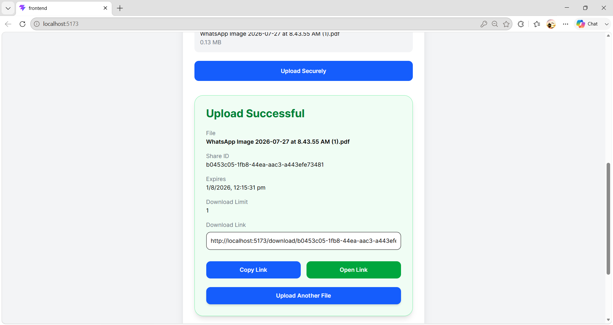
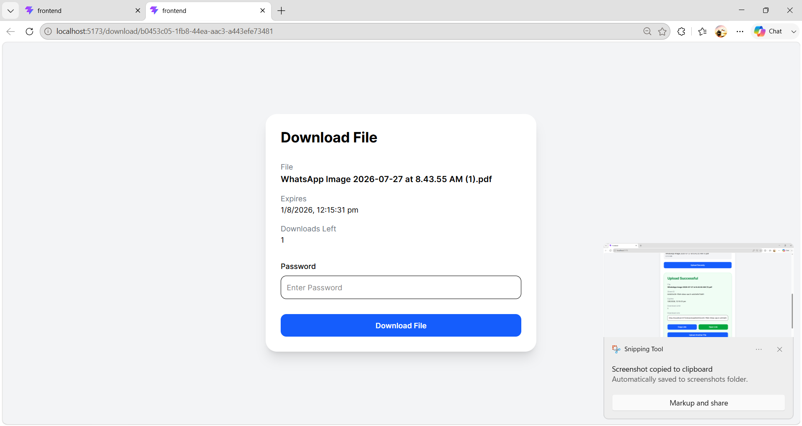

# 🔐 Secure File Sharing Service

A secure full-stack file sharing application built using **React, Node.js, Express, and MongoDB** that allows users to upload encrypted files and share them securely through unique download links.

The application protects files using **AES-256-GCM encryption**, supports **password-protected downloads**, **automatic file expiration**, and **download limits**.

---

## 🚀 Features

- 🔒 AES-256-GCM File Encryption
- 🔓 Automatic File Decryption During Download
- 🔑 Optional Password Protection
- ⏳ Automatic File Expiry (1 Hour, 24 Hours, 7 Days, 30 Days)
- 📥 Maximum Download Limit
- 🗑️ Automatic Cleanup using Cron Jobs
- 📁 Secure File Upload using Multer
- 🔗 Unique Shareable Download Links
- ⚡ Modern React Frontend
- 📱 Responsive User Interface
- 🛡️ Input Validation and Error Handling

---

# 🛠 Tech Stack

## Frontend

- React
- React Router
- Axios
- Tailwind CSS
- Vite

## Backend

- Node.js
- Express.js
- MongoDB
- Mongoose
- Multer
- bcrypt
- crypto
- node-cron
- dotenv

---

# 📂 Project Structure

```
Secure_File_Sharing_Service/

├── Backend/
│   ├── config/
│   ├── controllers/
│   ├── middlewares/
│   ├── models/
│   ├── routes/
│   ├── uploads/
│   ├── utils/
│   ├── index.js
│   └── package.json
│
├── Frontend/
│   ├── src/
│   │   ├── components/
│   │   ├── pages/
│   │   ├── assets/
│   │   ├── layouts/
│   │   ├── services/
│   │   └── App.jsx
│   └── package.json
│
└── README.md
```

---

# ⚙️ Installation

## Clone Repository

```bash
git clone https://github.com/Syeon-Dev-Arch/Secure_File_Sharing_Service

cd Secure_File_Sharing_Service
```

---

## Backend

```bash
cd Backend

npm install

npm run dev
```

---

## Frontend

```bash
cd Frontend

npm install

npm run dev
```

---

# 🔑 Environment Variables

Create a `.env` file inside the Backend folder.

```
PORT=4000

MONGODB_URI=YOUR_MONGODB_URI

AES_SECRET_KEY=YOUR_AES_SECRET_KEY
```

---

# 🔄 Workflow

1. Upload a File
2. File is Encrypted using AES-256-GCM
3. Metadata is Stored in MongoDB
4. Shareable Download Link is Generated
5. User Opens Link
6. Password Verification (if enabled)
7. File is Decrypted
8. File is Downloaded
9. Download Count Updates
10. Cron Job Deletes Expired Files

---

# 📸 Screenshots

### Home Page



### Upload



### Upload Success



### Success Page



### Download Page



# 📚 Future Improvements

- Drag & Drop Upload
- Email Sharing
- File Preview
- User Authentication
- Dashboard
- Download Analytics
- Cloud Storage (AWS S3 / Cloudinary)

---

# 👨‍💻 Author

**Syeon Dsouza**

B.Sc. Information Technology Student

---

# 📄 License

This project is licensed under the MIT License.
